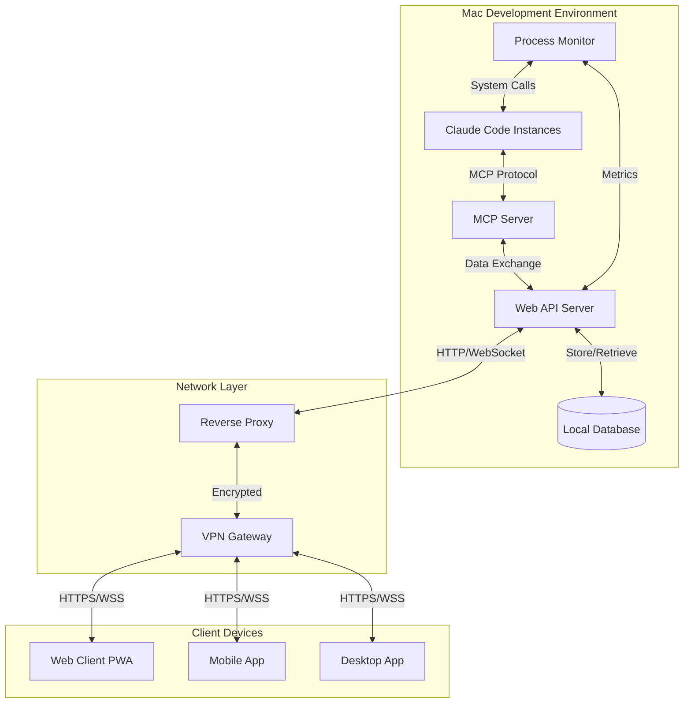

# Claude Code プロセス監視・制御システム 詳細仕様書

## 1. システム概要

### 1.1 目的

Mac環境で動作するClaude Codeプロセスを、MCP（Model Context Protocol）を活用してリアルタイムで監視・制御し、外部デバイスからWebブラウザやモバイルアプリ経由でアクセス可能にするシステム。

### 1.2 主要価値

- **場所に依存しない開発環境管理**
- **インテリジェントなプロセス監視**（AI思考レベルでの状況把握）
- **マルチデバイス対応**（スマートフォン、タブレット、PC）
- **セキュアなリモートアクセス**

## 2. システムアーキテクチャ

### 2.1 全体構成図



### 2.2 コンポーネント詳細

#### 2.2.1 MCP Server

- **役割**: Claude Codeとの深い連携、思考プロセス取得
- **技術**: Node.js/TypeScript
- **機能**:
  - Claude Code セッション情報取得
  - 実行中タスクの詳細監視
  - インタラクティブ制御
  - ファイル操作履歴追跡

#### 2.2.2 Process Monitor

- **役割**: システムレベルのプロセス監視
- **技術**: Node.js + native modules
- **機能**:
  - CPU/メモリ使用量監視
  - プロセス生死監視
  - tmuxセッション管理
  - システムメトリクス収集

#### 2.2.3 Web API Server

- **役割**: クライアントとの通信、データ統合
- **技術**: Express.js + Socket.io
- **機能**:
  - RESTful API提供
  - WebSocket通信
  - 認証・認可
  - データ集約・配信

## 3. 機能詳細仕様

### 3.1 プロセス監視機能

#### 3.1.1 基本監視項目

```typescript
interface ProcessInfo {
  pid: number;
  command: string;
  args: string[];
  cpu_usage: number;
  memory_usage: number;
  start_time: Date;
  status: 'running' | 'stopped' | 'error' | 'suspended';
  tmux_session?: string;
  working_directory: string;
}
```

#### 3.1.2 Claude Code固有情報

```typescript
interface ClaudeCodeSession {
  process_info: ProcessInfo;
  session_id: string;
  current_task?: {
    description: string;
    status: 'thinking' | 'executing' | 'waiting_input' | 'completed';
    progress: number;
    estimated_completion?: Date;
  };
  recent_actions: Action[];
  files_modified: FileChange[];
  conversation_context: string;
}
```

### 3.2 MCP統合機能

#### 3.2.1 MCPプロトコル実装

```typescript
interface MCPMessage {
  type: 'request' | 'response' | 'notification';
  method: string;
  params?: any;
  id?: string;
}

interface ClaudeThinkingProcess {
  current_reasoning: string;
  next_planned_actions: string[];
  confidence_level: number;
  context_summary: string;
  decision_factors: string[];
}
```

#### 3.2.2 リアルタイム情報取得

- **思考プロセス**: Claudeの判断理由、計画中のアクション
- **実行状況**: コード実行、ファイル操作、エラー処理
- **コンテキスト**: 会話履歴、作業状況の要約

### 3.3 制御機能

#### 3.3.1 プロセス制御

```typescript
interface ProcessControl {
  start(config: LaunchConfig): Promise<ProcessInfo>;
  stop(pid: number, force?: boolean): Promise<void>;
  restart(pid: number): Promise<ProcessInfo>;
  suspend(pid: number): Promise<void>;
  resume(pid: number): Promise<void>;
}
```

#### 3.3.2 インタラクティブ制御

```typescript
interface InteractiveControl {
  sendMessage(sessionId: string, message: string): Promise<void>;
  interruptTask(sessionId: string): Promise<void>;
  provideFeedback(sessionId: string, feedback: Feedback): Promise<void>;
  requestPause(sessionId: string): Promise<void>;
}
```

### 3.4 通知システム

#### 3.4.1 通知トリガー

- プロセス異常終了
- 長時間実行タスクの完了
- エラー発生
- リソース使用量閾値超過
- ユーザー定義イベント

#### 3.4.2 通知チャネル

```typescript
interface NotificationConfig {
  push_notifications: boolean;
  email_alerts: boolean;
  slack_webhook?: string;
  discord_webhook?: string;
  custom_webhooks: string[];
}
```

## 4. API設計

### 4.1 REST API エンドポイント

#### 4.1.1 プロセス管理

```
GET /api/v1/processes
GET /api/v1/processes/{pid}
POST /api/v1/processes/start
PUT /api/v1/processes/{pid}/control
DELETE /api/v1/processes/{pid}
```

#### 4.1.2 Claude Code セッション

```
GET /api/v1/sessions
GET /api/v1/sessions/{sessionId}
GET /api/v1/sessions/{sessionId}/thinking
POST /api/v1/sessions/{sessionId}/message
PUT /api/v1/sessions/{sessionId}/control
```

#### 4.1.3 システム情報

```
GET /api/v1/system/status
GET /api/v1/system/metrics
GET /api/v1/system/logs
```

### 4.2 WebSocket Events

#### 4.2.1 リアルタイム更新

```typescript
interface WebSocketEvents {
  'process_update': ProcessInfo;
  'session_update': ClaudeCodeSession;
  'thinking_update': ClaudeThinkingProcess;
  'system_alert': SystemAlert;
  'log_entry': LogEntry;
}
```

## 5. データモデル

### 5.1 データベーススキーマ

#### 5.1.1 プロセステーブル

```sql
CREATE TABLE processes (
  id INTEGER PRIMARY KEY,
  pid INTEGER UNIQUE,
  command TEXT,
  args TEXT,
  start_time DATETIME,
  end_time DATETIME,
  status TEXT,
  tmux_session TEXT,
  working_directory TEXT,
  created_at DATETIME DEFAULT CURRENT_TIMESTAMP
);
```

#### 5.1.2 セッションテーブル

```sql
CREATE TABLE claude_sessions (
  id TEXT PRIMARY KEY,
  process_id INTEGER,
  current_task TEXT,
  context_summary TEXT,
  last_activity DATETIME,
  created_at DATETIME DEFAULT CURRENT_TIMESTAMP,
  FOREIGN KEY (process_id) REFERENCES processes(id)
);
```

#### 5.1.3 ログテーブル

```sql
CREATE TABLE activity_logs (
  id INTEGER PRIMARY KEY,
  session_id TEXT,
  type TEXT,
  message TEXT,
  metadata TEXT,
  timestamp DATETIME DEFAULT CURRENT_TIMESTAMP,
  FOREIGN KEY (session_id) REFERENCES claude_sessions(id)
);
```

## 6. セキュリティ仕様

### 6.1 認証・認可

#### 6.1.1 JWT認証

```typescript
interface JWTPayload {
  user_id: string;
  permissions: Permission[];
  issued_at: number;
  expires_at: number;
  device_id: string;
}
```

#### 6.1.2 権限レベル

- **ADMIN**: 全操作可能
- **OPERATOR**: プロセス制御可能
- **VIEWER**: 閲覧のみ
- **GUEST**: 限定的な閲覧

### 6.2 通信セキュリティ

#### 6.2.1 暗号化要件

- TLS 1.3 必須
- 証明書ピニング（モバイルアプリ）
- VPN接続必須
- API率制限: 100req/min/IP

#### 6.2.2 セキュリティヘッダー

```javascript
{
  "Strict-Transport-Security": "max-age=31536000; includeSubDomains",
  "X-Content-Type-Options": "nosniff",
  "X-Frame-Options": "DENY",
  "X-XSS-Protection": "1; mode=block",
  "Content-Security-Policy": "default-src 'self'"
}
```

## 7. パフォーマンス要件

### 7.1 応答時間

- API応答: < 200ms（95%tile）
- WebSocket遅延: < 100ms
- UI操作応答: < 300ms
- プロセス制御実行: < 2秒

### 7.2 スループット

- 同時接続: 最大50デバイス
- API処理: 1000req/min
- WebSocket更新: 10Hz
- ログ処理: 1000entries/min

### 7.3 リソース使用量

- CPU使用率: < 10%（アイドル時）
- メモリ使用量: < 512MB
- ディスク容量: ログ30日分保持
- ネットワーク帯域: < 1Mbps

## 8. 運用・保守仕様

### 8.1 ログ管理

#### 8.1.1 ログレベル

- **ERROR**: システムエラー、例外
- **WARN**: 警告、パフォーマンス問題
- **INFO**: 操作ログ、状態変更
- **DEBUG**: 詳細デバッグ情報

#### 8.1.2 ログローテーション

- 日次ローテーション
- 30日間保持
- 圧縮保存
- 1GB超過時の緊急ローテーション

### 8.2 監視・アラート

#### 8.2.1 システムメトリクス

```typescript
interface SystemMetrics {
  cpu_usage: number;
  memory_usage: number;
  disk_usage: number;
  network_io: NetworkIO;
  process_count: number;
  active_sessions: number;
  api_response_time: number;
  error_rate: number;
}
```

#### 8.2.2 ヘルスチェック

```
GET /health
{
  "status": "healthy" | "degraded" | "unhealthy",
  "components": {
    "database": "healthy",
    "mcp_server": "healthy",
    "process_monitor": "healthy"
  },
  "timestamp": "2025-07-04T12:00:00Z"
}
```

## 9. 実装計画

### 9.1 Phase 1: 基本機能（4週間）

- [ ] プロセス監視システム
- [ ] 基本Web API
- [ ] シンプルなWebUI
- [ ] VPN設定・テスト

### 9.2 Phase 2: MCP統合（5週間）

- [ ] MCPサーバー開発
- [ ] Claude Code連携
- [ ] リアルタイム情報取得
- [ ] インタラクティブ制御

### 9.3 Phase 3: 高度機能（4週間）

- [ ] モバイルアプリ開発
- [ ] 通知システム
- [ ] 高度なUI機能
- [ ] パフォーマンス最適化

### 9.4 Phase 4: 運用準備（3週間）

- [ ] セキュリティ強化
- [ ] 監視・ログシステム
- [ ] ドキュメント整備
- [ ] テスト・デプロイ

## 10. リスク分析・対策

### 10.1 技術リスク

|リスク              |影響|対策        |
|-----------------|--|----------|
|MCP仕様変更          |高 |抽象化レイヤー導入 |
|Claude Code API変更|高 |柔軟なアダプター設計|
|VPN接続不安定         |中 |自動再接続機能   |
|パフォーマンス劣化        |中 |継続的監視・最適化 |

### 10.2 セキュリティリスク

|リスク    |影響|対策        |
|-------|--|----------|
|不正アクセス |高 |多要素認証、IP制限|
|データ漏洩  |高 |暗号化、アクセス制御|
|DoS攻撃  |中 |率制限、DDoS対策|
|証明書期限切れ|低 |自動更新、監視   |

## 11. 成功指標（KPI）

### 11.1 技術指標

- システム稼働率: > 99.5%
- API応答時間: < 200ms（95%tile）
- セキュリティインシデント: 0件/月
- パフォーマンス劣化: < 5%/月

### 11.2 利用指標

- 日次アクティブ利用: > 80%
- モバイル利用率: > 40%
- 外出先利用率: > 30%
- 緊急対応時間短縮: > 50%

このシステムにより、Claude Codeを活用した開発環境を、場所や時間に制約されることなく効率的に管理・制御できる、次世代の開発支援環境を実現します。
